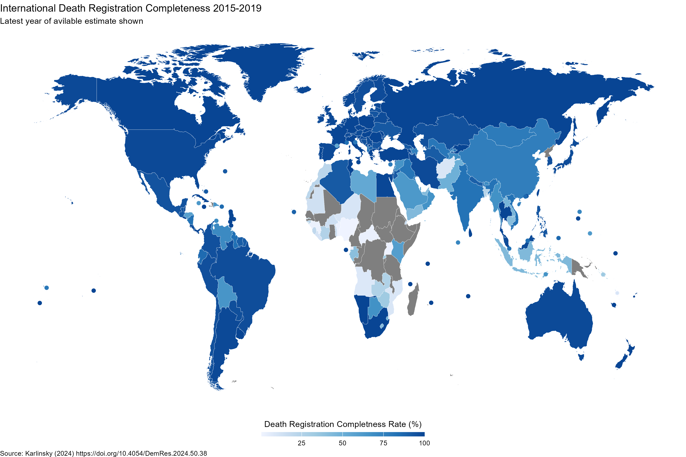

# International Completeness of Death Registration
This repository contains inputs and outputs of the paper: _International Completeness of Death Registration 2015-2019_, which contains the most up to date estimates of the completeness of death registration in 193 countries around the world. 

Paper and sources are detailed in (preprint): https://doi.org/10.1101/2021.08.12.21261978

Contributions and suggestions of information and data are welcome and will be credited.

## Contents

### 
`death_reg_final` is a csv file in easy to use machine-readable, longitudinal format, from which all the analyses in _International Completeness of Death Registration_ can be reproduced. The variables in the file are:

* `country_name`: Name of the country. 
* `year`: Year, ranges from 2015 to 2019.
* `reg_deaths`: The number of deaths registered in the vital registration system for the country-year. NA denotes no registered deaths data was obtained.
* `expected_wpp`: The number of deaths expected to occur for the country-year from [World Population Prospects 2022](https://population.un.org/wpp/).
* `expected_gbd`: The number of deaths expected to occur for the country-year from [Global Burden of Disease 2019](http://ghdx.healthdata.org/gbd-results-tool).
* `expected_ghe`: The number of deaths expected to occur for the country-year from [Global Health Estimates 2019](https://www.who.int/data/gho/data/themes/mortality-and-global-health-estimates).
* `expected_deaths`: The mean of `expected_wpp`, `expected_gbd` and `expected_ghe`.
* `death_comp`: The estimated completeness rate, ranges from 0 to 100%. Derived as `reg_deaths` divided by `expected_deaths`. See paper for details.
* `source`: Whether the source is WMD (World Mortality Dataset) or other. See _References_ in paper for detailed sources for countries not from WMD.
* `expected_confidence_score`: Ratio between min to max death completeness between WPP/GBD/GHE. from 0 (lowest) to 100% (highest confidence) (conditional on having at least 2 sources for `expected_deaths`).
